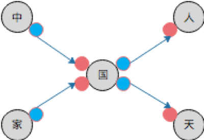
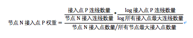
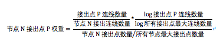
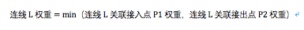
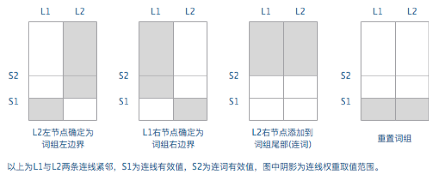
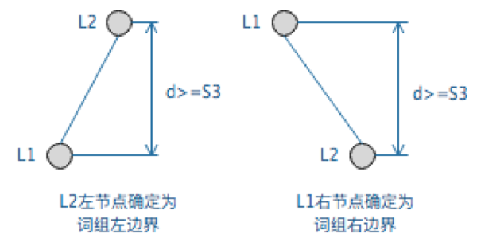
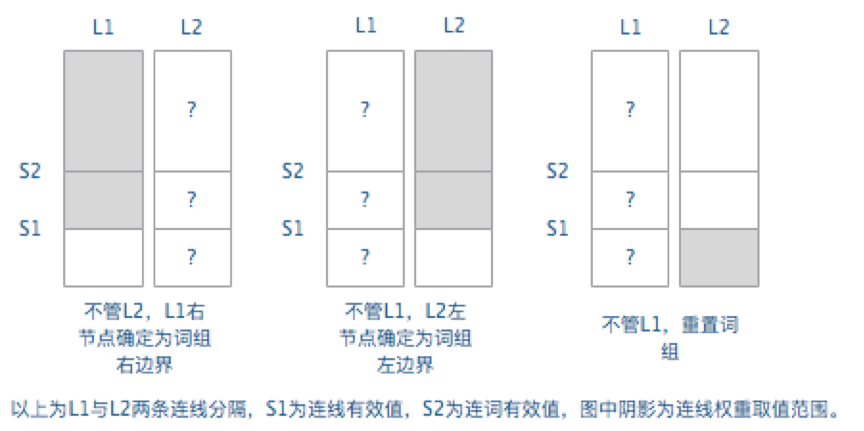

new-words-algorithm
===================
文本网络新词发现算法的优化案例

### 一、代码结构

优化前的文本网络新词发现算法位于包：<code>com.baitengsoft.bigdata.nwa.algm1</code>

优化后的文本网络新词发现算法位于包：<code>com.baitengsoft.bigdata.nwa.algm2</code>

### 二、文本网络新词发现算法介绍

文本网络由字符节点和连线（有向）组成。
字符节点表示在文本内容中出现过的一个字符，重复出现的字符在网络中只存在一个节点。
连线按照文本内容中字符与字符之间出现的先后顺序，连接两个字符节点。
字符节点又包括了若干接入点和接出点，用于关联连线的接入端和接出端。
每个接入点表示一组来自相同字符节点连线的接入端。
每个接出点表示一组去向相同字符节点连线的接出端。

通过预定义模型可以计算出文本网络中每条连线的权重，然后可以根据连线权重来判断连线两端字符节点组成词组的可能性，
把可能性最大的词组连词方案识别出来，就实现了从文本网络发现词组的目标。

纯粹通过文本网络发现词组的精度和误差很不稳定，因此在发现词组后还会结合现有分词组件和词库对发现的词组进行筛选，
最终完成新词的发现。

#### 步骤1：根据文本内容构建文本网络

对于"...中国人...家国天下..."这段文本，可以构建如下形式的文本网络区域：

<ul>
<li>图示中共有5个字符节点，其中"国"节点在文本中出现了2次。</li>
<li>每个节点左边的红色小点是接入点，右边的蓝色小点是接出点。</li>
<li>L1表示连接"中"和"国"这2个节点的连线，L2、L3、L4同理。
连线除了指定左右连接的字符节点外，还要指定连接的具体接入点和接出点。</li>
<li>根据文本顺序构建的连线，在文本网络中不会重复。</li>
</ul>

#### 步骤2：计算文本网络中每条连线的权重

1、先遍历所有字符节点，计算字符节点包括的接入点和接出点的权重：

2、再遍历所有连线，计算连线的权重：

#### 步骤3：根据连线权重识别词组

按照文本顺序遍历文本网络中的连线，前后连线的关系有紧邻和分隔两种，分别有以下判别规则：

1、对于前后连线紧邻的情况，根据连线的权重值有以下判别规则：

2、对于前后连线紧邻的情况，除前述规则外，还根据两条连线权重的差值进行判别：

3、对于前后连线分隔的情况，根据连线的权重值有以下判别规则：

根据以上规则判别的词组左边界和右边界可以识别出词组。

#### 步骤4：使用已有分词组件和词库对文本网络识别的词组进行筛选

1、如果分词组件的分词结果会把识别的词组截断（不是包含），则这个词组应该被丢弃。

2、如果识别的词组包含分词组件分出的连接词，则这个词组应该被丢弃。

